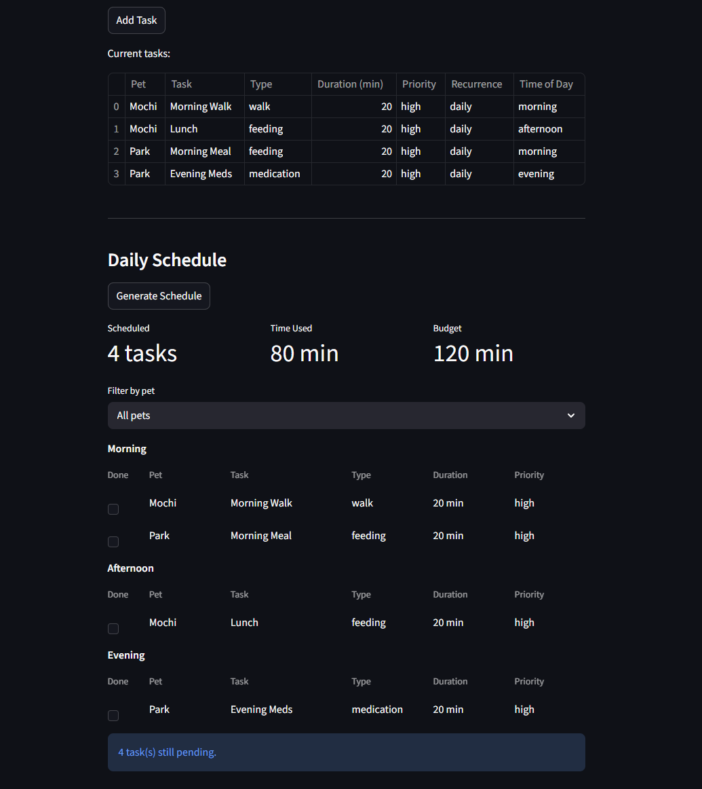

# PawPal+

**PawPal+** is a pet care planning app that helps busy pet owners stay on top of their animals' daily needs. Set your time budget, add your pets and tasks, and let PawPal+ build a smart daily schedule — automatically sorted, conflict-checked, and ready to go.

---

## Screenshot



---

## System Design


---

## Features

### Owner & Pet Management
- Create an owner profile with a configurable daily time budget
- Add multiple pets, each with their own independent task lists
- All data persists across interactions within a session

### Task Management
- Add tasks to any pet with a name, type, duration, priority, time of day, and recurrence
- Task types: `walk`, `feeding`, `medication`, `grooming`, `enrichment`
- Priority levels: `high`, `medium`, `low`
- Time slots: `morning`, `afternoon`, `evening`

### Sorting by Time
- The scheduler organizes tasks chronologically — morning before afternoon before evening
- Within a time slot, a `sort_order` field controls exact sequencing (e.g. give meds before breakfast)
- Priority and duration serve as automatic tie-breakers when sort order is equal

### Daily & Weekly Recurrence
- Tasks marked `daily` are automatically included in every plan
- Tasks marked `weekly` are scheduled only on their configured days (e.g. Monday, Thursday)
- When a daily or weekly task is marked complete, a fresh copy is automatically queued for the next occurrence
- Tasks marked `as_needed` are excluded from automatic scheduling but can be forced in with an override flag

### Budget Enforcement
- The scheduler respects the owner's daily time budget and will not overschedule
- Tasks that don't fit are collected in a skipped list — nothing is silently dropped
- The UI shows how many minutes are used versus the total budget

### Conflict Warnings
- If the same type of task is scheduled twice for the same pet in the same time slot, the plan flags it as a conflict
- Conflicts surface as visible warnings in the UI so the owner can resolve them

### Filtering & Status Tracking
- Filter the daily plan by pet to focus on one animal at a time
- Incomplete tasks are tracked separately so you can see what still needs to be done
- Tasks can be individually marked complete or reset

---

## Getting Started

### Setup

```bash
python -m venv .venv
source .venv/bin/activate  # Windows: .venv\Scripts\activate
pip install -r requirements.txt
```

### Run the app

```bash
streamlit run app.py
```

---

## Testing

```bash
python -m pytest tests/test_pawpal.py -v
```

17 tests covering budget enforcement, sorting correctness, recurrence logic, conflict detection, and edge cases (empty pets, missing due days, override flags).
