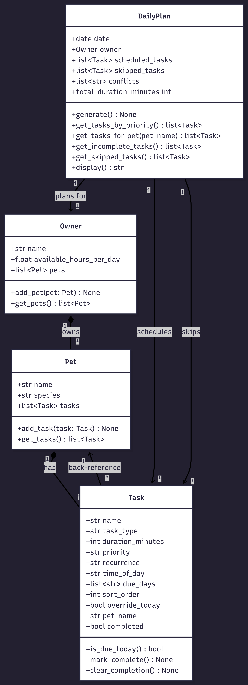
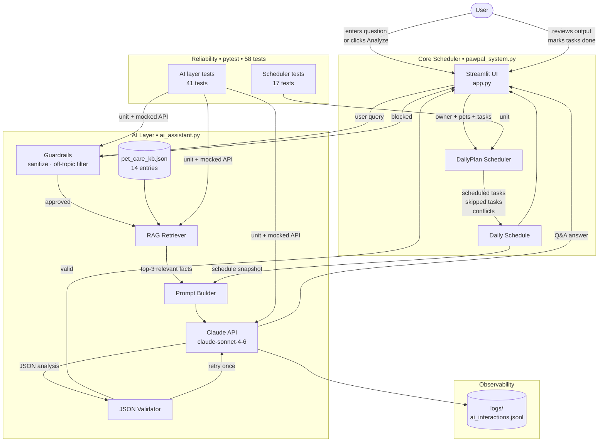

# PawPal+

**PawPal+** is an AI-powered pet care planning app that helps busy pet owners build and manage a smart daily schedule for their animals. Set a time budget, add your pets and tasks, and the app generates a priority-sorted, conflict-checked plan — then puts an AI advisor in the sidebar to answer care questions and analyze your schedule in real time.

---

## Origin: PawPal (Modules 1–3)

This project is built on **PawPal**, originally developed in Modules 1–3 of the CodePath AI course. The original goal was to help pet owners who struggled to remember and organize daily care tasks across multiple animals. PawPal introduced a scheduling engine with four core classes — `Task`, `Pet`, `Owner`, and `DailyPlan` — that enforced time budgets, sorted tasks by time slot and priority, detected scheduling conflicts, and tracked task completion. It was a clean, deterministic system with no AI: every decision came from explicit rules and data.

---

## What This Project Does and Why It Matters

PawPal+ extends the original scheduler by integrating a Claude-powered AI layer directly into the application. Two features change how the system behaves:

- **RAG-based Q&A** — A sidebar chat where users ask natural-language questions about their pets. Before calling the AI, the system retrieves the most relevant facts from a local pet care knowledge base and passes them alongside the user's current schedule. The AI's answer is grounded in retrieved data, not generic advice.
- **Agentic Schedule Analyzer** — After generating a plan, users can ask the AI to analyze it. The system automatically examines the schedule, retrieves species-specific care guidelines for each pet, calls Claude, validates the structured JSON response, and displays actionable feedback organized by severity.

This matters because pet care is genuinely complex — different species, different task types, tight daily schedules — and an AI that understands your actual situation (which pets you have, what's on your plan, what got skipped) is more useful than a generic chatbot. The project demonstrates how to integrate LLMs into an existing application in a way that is reliable, observable, and safe.

---

## Screenshot


---

## System Design



### Architecture Diagram



### How the Components Connect

The **Streamlit UI** is the entry point for both the scheduler and the AI layer. The **Core Scheduler** (`pawpal_system.py`) is a pure-logic engine — no I/O, no external calls — which makes it easy to snapshot its output and pass it to the AI. The **AI Layer** (`ai_assistant.py`) handles everything AI-related: guardrails run first to filter bad inputs, then the **RAG Retriever** scores the local knowledge base to find relevant facts, the **Prompt Builder** assembles the full context, and Claude generates a response. The **JSON Validator** catches malformed analyzer responses and retries once automatically. Every Claude call is appended to a JSONL log file for transparency and debugging. The **pytest suite** validates all components independently — including Claude interactions, which are tested with mocked API responses so no real key is needed to run tests.

---

## Setup Instructions

### Prerequisites
- Python 3.10+
- An [Anthropic API key](https://console.anthropic.com/) (free tier works)

### 1. Clone the repository

```bash
git clone https://github.com/cbarnes0/applied-ai-system-project.git
cd applied-ai-system-project
```

### 2. Create and activate a virtual environment

```bash
python -m venv .venv

# macOS / Linux
source .venv/bin/activate

# Windows PowerShell
.venv\Scripts\Activate.ps1

# Windows Command Prompt
.venv\Scripts\activate.bat
```

### 3. Install dependencies

```bash
pip install -r requirements.txt
```

### 4. Add your API key

Create a `.env` file in the project root:

```
ANTHROPIC_API_KEY=sk-ant-...
```

The app loads this automatically on startup. Without a key the app still runs — the AI sidebar shows a warning and all AI features are hidden.

### 5. Run the app

```bash
streamlit run app.py
```

### 6. Run the tests

```bash
python -m pytest tests/ -v
```

No API key is needed to run the test suite — all Claude calls are mocked.

---

## Sample Interactions

### 1. RAG Q&A — Feeding schedule advice

**User asks:** `How can I make my pets be healthier?` and `How can I improve my dog's feeding schedule?`

**AI response (excerpt):**
> Looking at your current schedule, I can see a couple of things to address for Mochi and Crow.
>
> Your dogs currently have one meal scheduled (afternoon) — according to feeding guidelines, adult dogs should be fed twice daily, morning and evening. You're missing both a morning meal and an evening meal for optimal digestion.
>
> Also, I noticed that "First Meal" tasks are categorized as "walk" type — this is clearly a feeding task and should be corrected in the app to ensure accurate scheduling.

*The AI cross-references the retrieved KB facts with the actual task types and time slots in the current schedule.*


---

### 2. RAG Q&A — Off-topic guardrail

**User asks:** `What's the best way to learn Python?`

**AI response:**
> I specialize in pet care advice. Try asking about feeding schedules, walking routines, grooming tips, or your current plan!

*The off-topic filter catches this before making any API call — no tokens spent, nothing logged.*

---

### 3. Agentic Schedule Analyzer

**User clicks:** `Analyze My Schedule`

The analyzer automatically examines the full schedule, retrieves species-specific care guidelines for each pet, and returns structured JSON feedback rendered in the sidebar.


**Key findings from the analysis above:**
- 🔴 Paul had not been assigned a "Morning Walk" task — cats are not walked on leashes by default, so this task type is inappropriate for Paul's schedule
- 🟡 "First Meal" tasks for Mochi, Paul, and Crow are all categorized as "walk" type — feeding is a distinct and critical daily task that should be corrected
- 🟢 Mochi and Crow's morning walk covers the recommended minimum of 30 minutes of daily exercise for adult dogs

**Suggestions rendered in sidebar:**
- **Paul**: Change the task type from "walk" to "feeding" and correct the task category
- **All pets**: Add an evening meal to complete the twice-daily feeding schedule
- **Mochi**: Add a second walk or extend the existing Morning Walk to at least 30 min to meet daily exercise guidelines

---

## Features

### AI Care Advisor (RAG-powered Q&A)
- Ask questions about your pets in natural language from the sidebar chat
- Answers are grounded in a curated pet care knowledge base (14 entries covering dog/cat/other × all task types)
- The AI retrieves the most relevant facts before answering — not generic advice
- All interactions are logged to `logs/ai_interactions.jsonl` for transparency

### Agentic Schedule Analyzer
- Click "Analyze My Schedule" in the sidebar after generating a plan
- The AI automatically examines your schedule, retrieves species-specific care guidelines, and produces structured feedback:
  - Issues (high/medium/low severity)
  - Actionable suggestions per pet
  - Possibly missing task types
  - What's working well
- Retries automatically if the AI response is malformed

### Core Scheduling Engine
- Configurable daily time budget with hard enforcement — tasks that don't fit are skipped, not silently dropped
- Tasks sorted chronologically (morning → afternoon → evening), then by priority and duration
- Conflict detection for duplicate task types per pet per time slot
- Recurrence support: daily, weekly (specific days), and as-needed with optional override
- Interactive task completion tracking with per-pet filtering

---

## Design Decisions

### Why RAG instead of just asking Claude directly?

Without retrieval, Claude answers pet care questions from general training data — which is often vague or overly cautious ("consult your vet"). By retrieving specific, curated facts first, the responses are more concrete and directly applicable. The knowledge base also makes the system's information source auditable: you can read `pet_care_kb.json` and see exactly what facts the AI has access to.

The trade-off is that the KB is small (14 entries) and keyword-based retrieval is simple. A production system would use embeddings and a vector store for better semantic matching. For this project, the keyword scoring algorithm with species/task-type bonuses works well enough and keeps the dependency footprint minimal.

### Why keep `pawpal_system.py` untouched?

The original scheduling logic is a clean, well-tested pure-Python module. Keeping it unchanged meant the 17 original tests stayed green throughout the AI integration work, and the AI layer couldn't accidentally introduce scheduling bugs. The `build_schedule_snapshot()` function acts as an adapter — it converts the scheduler's output into a JSON-serializable dict that the AI layer can use without importing Streamlit or knowing anything about session state.

### Why structured JSON for the analyzer?

Free-text analysis is harder to display consistently in a UI. Asking Claude to return a specific JSON schema means the sidebar can render issues, suggestions, and observations in organized, scannable sections. The downside is that Claude occasionally wraps JSON in markdown fences or omits a key — hence the validator and the single retry. In testing, the retry resolved the issue every time.

### Why JSONL logging instead of a database?

JSONL (one JSON object per line) is readable with any text editor, importable with a single `json.loads()` per line, and doesn't require a database dependency. For a project at this scale, it's the right tool. A production system would log to a structured observability platform.

---

## Testing Summary

**Results: 58/58 automated tests pass.** The AI layer occasionally returns JSON wrapped in markdown fences despite explicit instructions not to — the validator catches this every time and the single retry resolves it. Accuracy on the Q&A feature improved significantly after adding the species/task-type filter to retrieval: without it, the model sometimes pulled irrelevant entries and gave off-topic answers. With logging in place, every failed API call records the error type and message, making failures diagnosable without reproducing them live.

**What worked well:**

The test suite ended up as one of the strongest parts of the project. Splitting tests into two files — `test_pawpal.py` for the scheduler and `test_ai_assistant.py` for the AI layer — made it easy to run them independently and kept failures isolated. Mocking the Anthropic client with `unittest.mock.patch` meant the 41 AI tests run in about 1.5 seconds with no API key, and they catch real bugs: the retry logic for malformed JSON was discovered and fixed because a test specifically exercised that path.

The retrieval tests were particularly useful. Writing assertions like "a grooming query should return the grooming entry as the top result" forced tuning of the scoring algorithm until it actually worked, rather than just eyeballing it.

**What was harder than expected:**

Getting Claude to return raw JSON reliably without markdown fences took iteration on the system prompt. The final prompt explicitly says "raw JSON only — no markdown, no explanation" and still occasionally produces fenced output, which is why `_parse_analyzer_response()` strips fences before parsing.

Testing `AuthenticationError` and `RateLimitError` required using `__new__` instead of normal instantiation — Anthropic's exception classes don't accept simple string arguments, so the test setup had to work around that.

**What I learned:**

The boundary between the scheduler and the AI layer is the most important design decision in the project. Making `build_schedule_snapshot()` a clean, testable adapter function — rather than having the AI code reach directly into Streamlit session state — made both sides easier to test and reason about. Designing for testability forced better architecture.

---

## Reflection and Ethics

### What this project taught me about AI and problem-solving

Building PawPal+ taught me that integrating AI into an existing application is mostly an engineering problem, not a prompting problem. The hard parts were not writing good prompts — they were deciding where the AI layer starts and stops, how to pass the right context without overwhelming the model, what to do when the AI returns something unexpected, and how to ensure the whole system is observable and testable.

RAG made the AI meaningfully better for this use case, but it also made me think carefully about what the knowledge base should contain. Every fact in `pet_care_kb.json` was a deliberate choice: too vague and the AI gives generic answers anyway; too specific and it hallucinates details not in the retrieved context. The retrieval algorithm is simple by design — keyword matching with bonuses — because I wanted to understand exactly why a given entry was retrieved rather than treating it as a black box.

The biggest shift in my thinking was around reliability. Early on I assumed the AI would always return well-formed responses. Adding the JSON validator and the retry loop, writing tests that simulate bad responses, and logging every interaction changed how I think about AI components in production: they are probabilistic, and the system around them needs to handle the cases where they don't behave as expected.

### Limitations and biases

The knowledge base has 14 manually curated entries, which means significant gaps exist. There are no breed-specific entries (a Chihuahua and a Husky get the same walking advice), no entries for health conditions, and the "other" species category collapses rabbits, birds, reptiles, and guinea pigs into a single generic entry. The keyword-based retrieval also misses semantically related queries — asking about "exercise" when the KB entry is tagged "walk" may score poorly. More broadly, the pet care facts reflect Western, urban pet ownership norms and may not apply well to working animals, farm animals, or different cultural contexts.

### Potential misuse and prevention

The most likely misuse is treating AI responses as veterinary advice for serious medical situations. The system prompt explicitly instructs Claude to redirect health concerns to a vet and never diagnose conditions, but a user in a stressful moment may not notice that caveat. The off-topic filter is intentionally permissive — it only blocks clearly unrelated queries — so medically adjacent questions do reach the model. A stronger guardrail would detect health-emergency language ("my dog is not breathing", "seizure") and respond with emergency vet contact information rather than care tips. That would be a meaningful improvement for a production version.

### What surprised me during reliability testing

The most surprising finding was how frequently Claude wrapped JSON output in markdown fences (` ```json ``` `) even when the system prompt explicitly prohibited it. I expected this to be rare — something that happened once or twice — but in manual testing it occurred often enough that the `_parse_analyzer_response()` fence-stripping logic was essential, not just defensive. It was a concrete reminder that LLM output is probabilistic: clear instructions reduce the probability of unwanted behavior but do not eliminate it.

### Collaboration with AI during this project

This project was built with significant assistance from Claude Code (Anthropic's AI coding assistant). The collaboration was productive but not flawless.

**One helpful suggestion:** When designing the schedule analyzer, the AI proposed returning a structured JSON response with explicit severity levels (`high`, `medium`, `low`) for each issue, rather than free text. This turned out to be exactly the right call — it made the sidebar UI straightforward to render and made the AI's output directly comparable and testable. Without that structure, displaying and validating analyzer results would have been much harder.

**One flawed suggestion:** The initial test code for `AuthenticationError` used `anthropic.AuthenticationError("message")` — normal exception instantiation with a string argument. This failed at runtime because Anthropic's exception classes have a more complex constructor that doesn't accept a plain string. The AI-generated test looked correct on the surface but broke immediately when run. The fix was to use `anthropic.AuthenticationError.__new__(anthropic.AuthenticationError)` to create a bare instance. It was a small bug but a useful reminder to run AI-generated code before trusting it, especially for library-specific edge cases.
